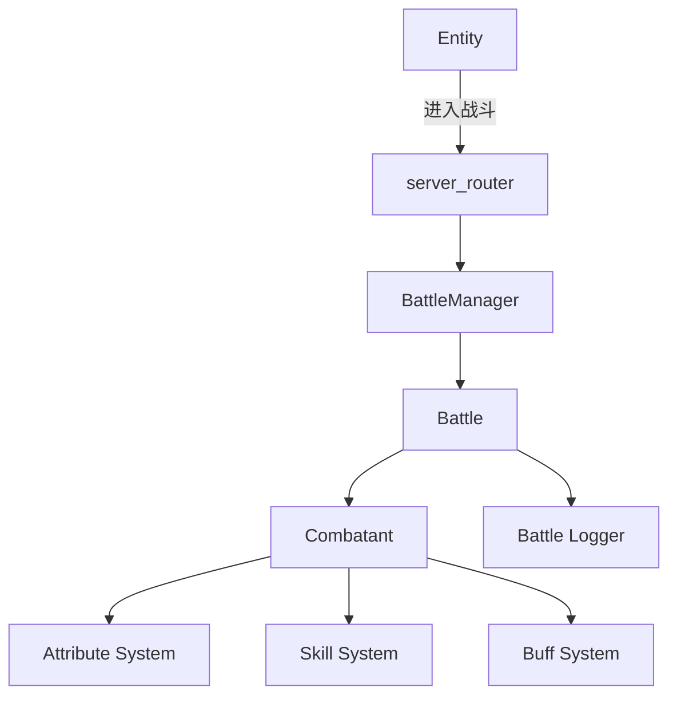

# 服务器端战斗与技能系统设计（初稿）

## 目录
1. [概述](#1-概述)
2. [系统架构](#2-系统架构)
3. [核心模块设计](#3-核心模块设计)
4. [数据管理](#4-数据管理)
5. [技能与Buff执行流程](#5-技能与buff执行流程)
6. [扩展性与高可用性设计](#6-扩展性与高可用性设计)
7. [框架性能](#7-框架性能)
8. [总结](#8-总结)

## 1. 概述
本设计文档希望为服务器端战斗与技能系统的开发提供全面的架构与模块设计方案。主要的技能参考来源《dota2》（我的最爱）还有《剑与远征启辰》，针对高可用、多层次、高拓展性需求进行了定制化设计。系统的主要目标是通过组合一个个简单的“技能原子”实现复杂的战斗技能机制，支持多样化的技能，并确保与业务逻辑的解耦，提升系统的可维护性与可扩展性。

## 2. 系统架构
服务器端战斗与技能系统采用模块化和消息驱动的架构，核心组件包括战斗管理器、战斗对象、属性系统、技能系统、Buff系统、效果系统和战斗日志记录器。底层基于 Skynet 框架之上，利用其高性能的协程调度机制，实现高并发处理与高效资源管理。

### 2.1 系统架构图

### 3. 核心模块设计
#### 3.1 Battle Manager（战场管理器）
职责：

1. 管理战场battle的生命周期，创建，启动，销毁等
2. 协议路由 - 战斗协议统一入口，负责将操作指令路由到battle战场处理

#### 3.2 battle（战场）
职责：

1. 管理战斗的整体流程，包括战斗的开始、进行和结束。
2. 处理战斗对象（Combatant）的创建与销毁。
3. 与其他系统（如通信模块、日志记录器）协作。

关键功能：

1. 战斗初始化：收集所有进入战斗的Entity的战斗相关属性，创建对应的Combatant。
2. 战斗循环管理：控制战斗的回合制流程，触发技能与Buff的执行时机。
3. 战斗结束处理：计算最终战斗结果，处理战斗后的结算逻辑。

#### 3.3 Combatant（战斗对象）
职责：

1. 代表进入战斗的实体，即可以战斗的单位（如野怪、部队、箭塔 亦或是 英雄 等）。
2. 统一管理战斗相关的所有属性与状态。
3. 提供技能释放与Buff接收的接口。-- 主要的组件有（属性系统），buff系统，技能系统，后续会介绍。

关键属性：

1. ID：唯一标识符。
2. 类型：区分不同类型的战斗对象（野怪、部队等）。
3. 属性模块：引用属性系统管理的各种属性。
4. 技能列表：拥有的技能及其状态（冷却、次数等）。
5. Buff列表：当前附加的Buff及其状态。

Dota 2 示例： 在 Dota 2 中，Combatant 对应于游戏中的英雄、野怪、塔等单位。例如，英雄“Lina”作为一个 Combatant，拥有多种技能，如“Light Strike Array”和“Dragon Slave”。

#### 3.4 Attribute System（属性系统）
职责：

1. 管理战斗对象的各种属性，如生命值（HP）、魔法值（MP）、攻击力（ATK）、防御力（DEF）等，凡是k，v之类的属性都可以管理。
2. 提供属性的获取与修改接口。

设计思路：

1. 模块化属性：将属性分为不同的模块（如基础属性、战斗属性），便于管理与扩展。
2. 属性加成机制：支持通过Buff、技能等途径对属性进行加成或削减。

关键功能：

1. 属性初始化：根据Entity的数据，初始化Combatant的属性。
2. 属性修改：支持动态修改属性，如受到伤害、治疗等。
3. 属性查询：提供高效的属性查询接口，供技能与Buff使用。

#### 3.4 Skill System（技能系统）
职责：

1. 管理战斗对象拥有的所有技能。
2. 处理技能的释放与触发逻辑。
3. 管理技能的冷却时间与释放次数。

设计思路：

1. 技能：一个技能 = 技能的释放流程 + 目标策略 + buff + effect + （数值）
2. 技能实例化：每个Combatant根据其拥有的技能模板创建技能实例，管理其状态。
3. 技能触发条件：定义技能的触发条件，如主动释放、被动触发等。

关键功能：

1. 技能释放：处理技能的释放流程，包括目标确定、Buff应用、Effect执行等。
2. 冷却管理：管理技能的冷却时间。
3. 释放次数管理：限制技能的释放次数，如终极技能的使用次数等。

Dota 2 示例： 以英雄“Lina”的技能“Light Strike Array”为例：

1. 技能类型：主动技能，范围技能。
2. 技能释放：玩家选择目标 释放“Light Strike Array”。
3. 目标确定：技能在指定范围内的敌方单位。
4. Buff应用：每个受影响的单位会被施加伤害Buff。
5. Effect执行：每个Buff执行“hurt”Effect，造成100点魔法伤害。
6. 冷却管理：技能进入冷却状态，无法立即再次释放。

#### 3.5 Buff System（Buff系统）
职责：

1. 管理战斗中附加到Combatant上的各种Buff效果。
2. 处理Buff的应用、持续、叠加与移除逻辑。

设计思路：

1. Buff模板：预定义各种Buff的基础数据与行为逻辑，便于复用与扩展。
2. Buff实例化：每个Combatant根据其接收的Buff模板创建Buff实例，管理其状态。
3. Buff触发时机：定义Buff的触发时机，如挂载时、回合开始时、回合结束时等。

关键功能：

1. Buff应用：将Buff附加到Combatant上，触发对应的Effect。
2. Buff持续管理：管理Buff的持续时间与触发条件。
3. Buff移除：在Buff结束时移除，执行removebuff回调接口。

Dota 2 示例：英雄 装备 “蝴蝶”， 提供35%的闪避：
Buff类型：被动Buff，提供闪避效果。
Buff应用：当“Blur”被激活时，Combatant会获得一个Buff，提升闪避率。
Effect执行：在Combatant受到攻击时，有一定几率完全避开攻击。-- 思考：假如 英雄 还 装备了另一个道具，提供第一次被攻击必定闪避的buff，cd 3s，如果去设计被动buff的执行顺序？ 优先级 还是 其他机制？
Buff持续管理：Buff持续时间或通过技能冷却间隔自动刷新。

#### 3.7 Effect System（效果系统）
职责：

1. 定义和执行Buff的具体效果，如伤害、治疗、属性加成等。
2. 支持效果的条件判断与组合。

设计思路：

1. Effect模块化：将各种Effect（如hurt、heal、reflectHurt）封装为独立模块，便于复用与扩展。
2. 条件逻辑：支持Effect执行前的条件判断，确保效果在特定条件下才生效。
3. 效果组合：支持多个Effect的组合执行，满足复杂的技能需求。

关键功能：

1. Effect执行：根据Buff的配置执行具体效果，如计算伤害、修改属性等。
2. 条件判断：在执行Effect前，根据条件决定是否生效。
3. 效果叠加：支持多个Effect对同一目标的叠加与优先级处理。

思考：

1. 斯文风暴之锤的技能该如何实现？效果是击中的目标眩晕+伤害，主要复杂的点在于 技能是点目标进行释放，但是目标在过程中可能移动，以及状态改变，所以会有跳刀躲锤（短距离位移弹道会追着跑），分身躲，还有黑鸟关，毒狗关灯操作。状态改变 这块应该可以用状态互斥的机制来处理，但是位移目前看只能高频tick计算，还有类似于 箭塔攻击全图追白牛跑等。。。

#### 3.8 Combat Logger（战斗日志记录器）
职责：

1. 记录整个战斗过程中的关键事件与数据。
2. 提供战斗回放与数据分析的支持。

设计思路：

1. 事件记录：每个关键事件（技能释放、Buff应用、伤害计算等）都被记录下来。
2. 数据结构化：采用结构化的数据格式，便于后续的查询与分析。
3. 持久化与查询：支持日志的持久化存储与高效查询，确保数据的完整性与可用性。

关键功能：

1. 实时记录：在战斗过程中实时记录事件与数据。
2. 回放支持：通过战斗日志实现战斗过程的回放功能。
3. 数据分析：支持对战斗日志进行统计与分析，优化战斗系统。

#### 4. 数据管理
##### 4.1 属性收集与管理
流程：

1. 战斗前属性收集：

   * 从Entity数据中提取所有与战斗相关的属性。
   * 通过 combatAttrCollect 收集并汇总这些属性，为Combatant创建做准备。

2. Combatant创建：
   * 战斗开始时，根据收集到的属性创建Combatant对象。
   * Combatant对象包含所有战斗相关的属性，统一管理与战斗逻辑相关的数据。

设计建议：

1. 属性模板化：定义属性的模板，明确各类Combatant的基础属性结构。
2. 数据隔离：将战斗相关属性与业务逻辑属性分离，避免战斗系统与业务逻辑的耦合。
3. 数据同步：战斗结束后，统一进行战斗后的业务回调。

#### 5. 技能与Buff执行流程
##### 5.1 技能释放流程
步骤：

1. 技能触发：
   * Combatant（技能发起者）主动释放技能，或被动技能触发。
   * 技能系统检查技能的冷却时间与释放次数，决定是否允许释放。

2. 目标确定：
   * 根据技能类型（范围目标、单体目标、自身等，后续统一称为 技能目标策略）确定技能的目标。
   * 目标确定可能涉及范围计算、目标筛选等复杂逻辑，任意技能可以组合任意目标策略。

3. Buff遍历与应用：
   * 遍历技能包含的所有Buff。
   * 将Buff挂载到目标Combatant（buff可以使用技能目标，也可以组合自己的目标策略）上，记录Buff的相关状态（如冷却时间、持续时间等）。

4. Buff执行时机：
   * 根据Buff的配置，决定其执行时机（如挂载即执行、回合开始时执行、回合结束时执行等）。

5. Effect执行：
   * 每个Buff包含的Effect根据其配置执行具体的效果，如伤害、治疗、属性加成等。

6. 技能状态更新：
   * 更新技能的冷却时间、释放次数等状态信息。

Dota 2 示例： 技能示例：英雄“Lina”的“Dragon Slave”
1. 技能触发：
   * 玩家主动释放“Dragon Slave”。
   * 技能系统检查“Dragon Slave”的冷却时间，如果未冷却则允许释放。
2. 目标确定：
   * 技能为直线范围伤害技能，确定技能的释放方向与范围内的敌方单位。
3. Buff遍历与应用：
   * “Dragon Slave”包含一个伤害Buff，将其应用于所有被技能命中的敌方单位。
4. Buff执行时机：
   * Buff配置为挂载即执行，立即对目标单位造成伤害。
5. Effect执行：
   * 每个Buff执行“hurt”Effect，造成100点魔法伤害。
6. 技能状态更新：
   * “Dragon Slave”进入冷却状态，无法立即再次释放。

##### 5.2 Buff执行流程
步骤：
1. Buff初始化：
   * 根据Buff的配置，初始化其属性与效果。
2. Buff挂载：
   * 将Buff附加到目标Combatant上，记录Buff的来源（技能发起者、技能类型等）。
3. Buff执行：
   * 在指定的执行时机（如挂载即执行、回合开始时执行）触发Buff的Effect执行。
4. Buff生命周期管理：
   * 记录Buff的持续时间与条件，定期检查Buff是否需要被移除或更新。
5. Buff移除：
   * 当Buff的持续时间结束或被条件触发移除时，执行Buff的清理逻辑。

##### 5.3 Effect执行流程
步骤：
1. Effect调用：
   * Buff触发时，调用Effect系统执行具体的效果逻辑。
2. 效果执行：
   * 根据Effect类型（如hurt、heal、buff），执行相应的效果逻辑。例如，hurt效果会计算并扣除目标Combatant的生命值。

思考：
1. 效果叠加应该如何实现？例如：对同一目标连续攻击伤害不断加成。-- 印记系统

#### 6. 扩展性与高可用性设计
##### 6.1 模块化设计
设计思路：
* 技能系统拆分为独立的模块（如Skill System、Buff System、Effect System等），每个模块负责特定的功能。
* 通过接口与事件驱动实现模块之间的协作，确保模块之间的低耦合与高内聚。

#### 7. 框架性能
##### 7.1 通用服务器管理与调度机制
设计思路：集中管理所有 battle_manager 服务实例，并为每个服务分配一定的战场负载 (battle)，从而在多个 CPU 核心上“横向扩展”处理。
1. 集中管理：创建一个“server_router”服务，用于记录所有 battle_manager 服务实例，并管理其当前负载（已创建的战场数量）。
2. 负载均衡：当有新的战场需求时，先查询所有可用的 battle_manager 实例，看谁的战场数量更少或者尚未达上限，分配给它以保持负载平衡。
3. 扩缩容：如果现有的 battle_manager 实例都接近饱和，可以动态创建新的 battle_manager 实例（或在服务器启动时固定数量），从而“横向扩展”战斗处理能力。

#### 8. 总结

